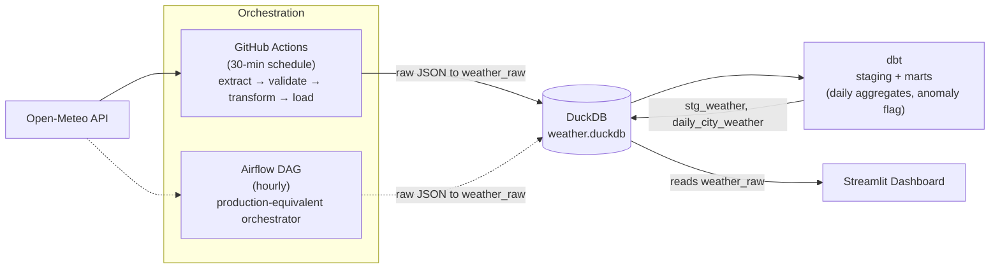
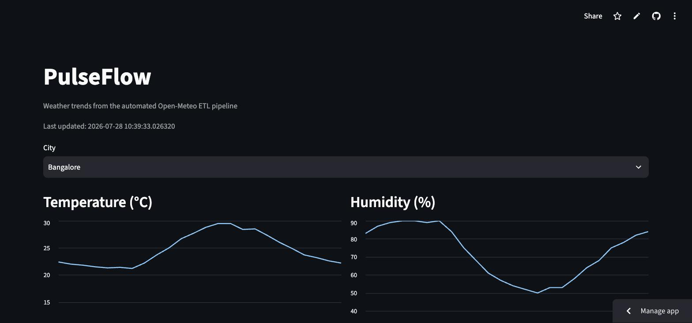
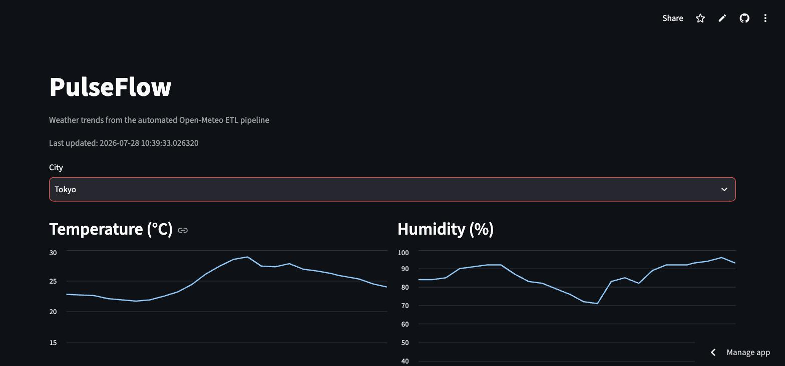

# PulseFlow

An automated weather ETL pipeline. Every 30 minutes it pulls current conditions and a 24-hour hourly forecast for 10 cities from the Open-Meteo API, validates and flattens the data, loads it into DuckDB, models it with dbt, and serves it through a Streamlit dashboard.

## Overview

PulseFlow tracks live and forecast weather for 10 cities (Chennai, Mumbai, Delhi, Bangalore, London, New York, Tokyo, Singapore, Dubai, Sydney) using the free, key-less [Open-Meteo](https://open-meteo.com/) API.

The pipeline:

1. **Extract** — fetch current weather + 24hr hourly forecast per city, save raw JSON.
2. **Validate** — check required fields exist and are non-null; skip and log bad records.
3. **Transform** — flatten current + hourly readings into tabular rows per city per timestamp.
4. **Load** — upsert rows into a `weather_raw` table in DuckDB.
5. **Model** — dbt cleans and types the raw data (staging) and computes daily per-city aggregates plus a temperature-anomaly flag (marts).
6. **Visualize** — a Streamlit dashboard reads DuckDB directly and shows per-city temperature/humidity trends.

The live pipeline runs on a GitHub Actions schedule and commits the updated `data/weather.duckdb` back to the repo. An Airflow DAG mirrors the same extract → validate → transform → load logic as the production-equivalent orchestrator, for environments that need a "real" scheduler instead of CI cron.

## Architecture



GitHub Actions is the live, hosted path (solid lines). The Airflow DAG (dashed lines) runs the identical extract/transform/load code on an hourly schedule and is meant as a drop-in production orchestrator — see `docker-compose.yml` to run it locally.

## Tech Stack

- **Python 3.11** — extract/transform scripts
- **[Open-Meteo API](https://open-meteo.com/)** — weather data source, no API key required
- **DuckDB** — embedded analytical database (`data/weather.duckdb`)
- **dbt-duckdb** — SQL data modeling (staging + marts)
- **Streamlit** — dashboard and visualization
- **GitHub Actions** — live/hosted scheduling, runs the pipeline and commits the updated database
- **Apache Airflow** (via Docker Compose) — production-equivalent orchestration reference implementation
- **Docker / Docker Compose** — local Airflow environment

## Live Demo

🔗 **Streamlit dashboard:** [pulseflow-weather.streamlit.app](https://pulseflow-weather.streamlit.app/)

## Setup

### Prerequisites

- Python 3.11+
- [Docker](https://www.docker.com/) (only needed if you want to run the Airflow DAG locally)

### 1. Clone and install dependencies

```bash
git clone <repo-url>
cd PulseFlow
python3 -m venv .venv
source .venv/bin/activate
pip install -r requirements.txt
```

### 2. Run the pipeline once

```bash
python extract/fetch_weather.py     # extract: raw JSON → data/raw/
python extract/transform_load.py    # validate + transform + load → data/weather.duckdb
```

### 3. Build the dbt models (optional)

```bash
cd dbt
dbt deps --profiles-dir .
dbt build --profiles-dir .
cd ..
```

### 4. Launch the dashboard

```bash
streamlit run dashboard/app.py
```

### 5. Run the Airflow DAG locally (optional)

```bash
docker compose up
```

Airflow UI at [http://localhost:8080](http://localhost:8080) — the admin password is printed in the container logs on first boot (`docker compose logs airflow`).

### Environment variables

Copy `.env.example` to `.env` if needed. No keys are required for the current pipeline; it's a placeholder for future config.

## Screenshots

**Dashboard — Bangalore**



**Dashboard — Tokyo**


